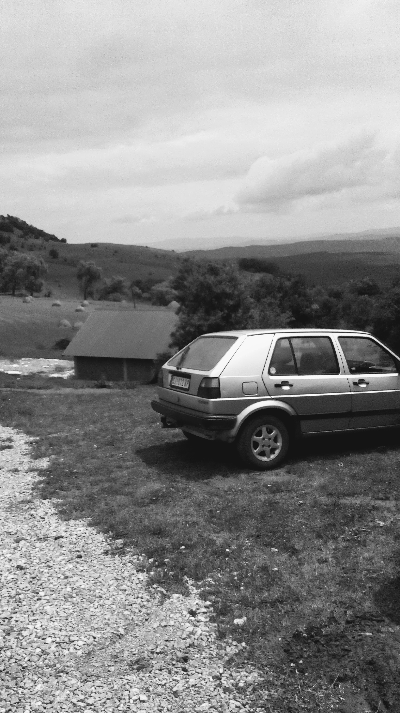
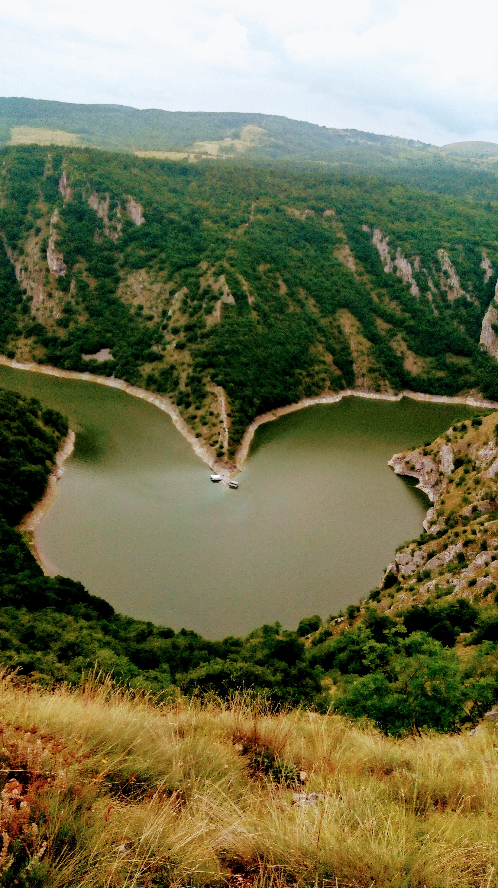
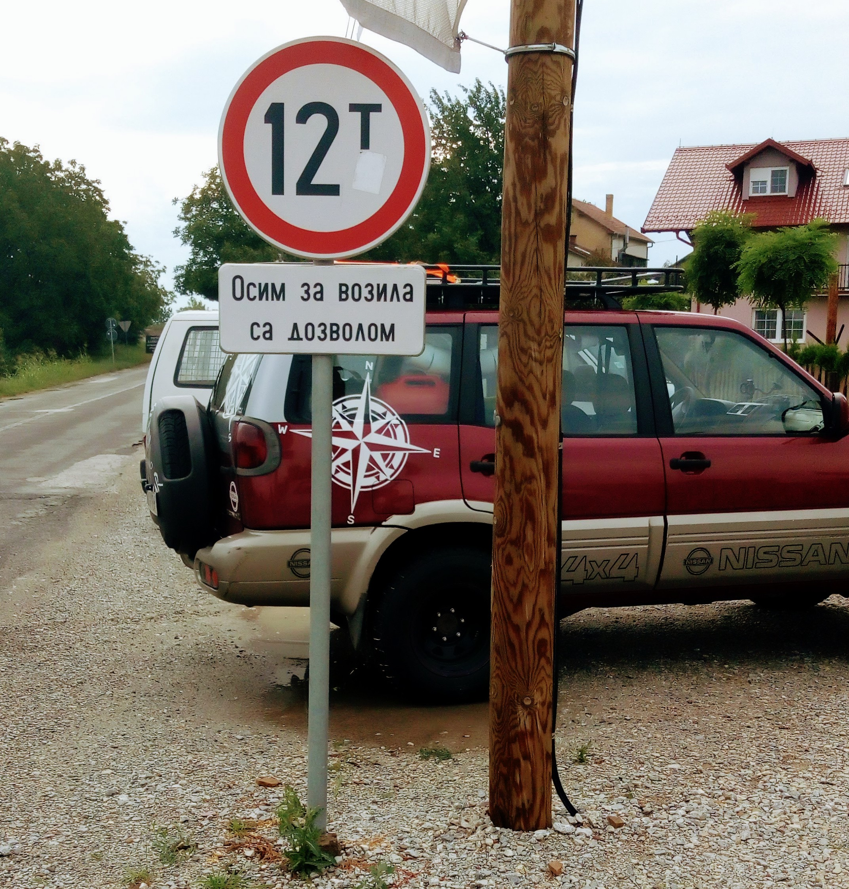
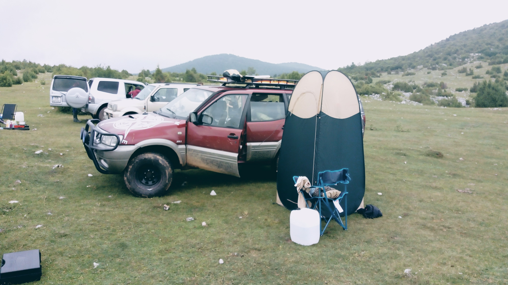
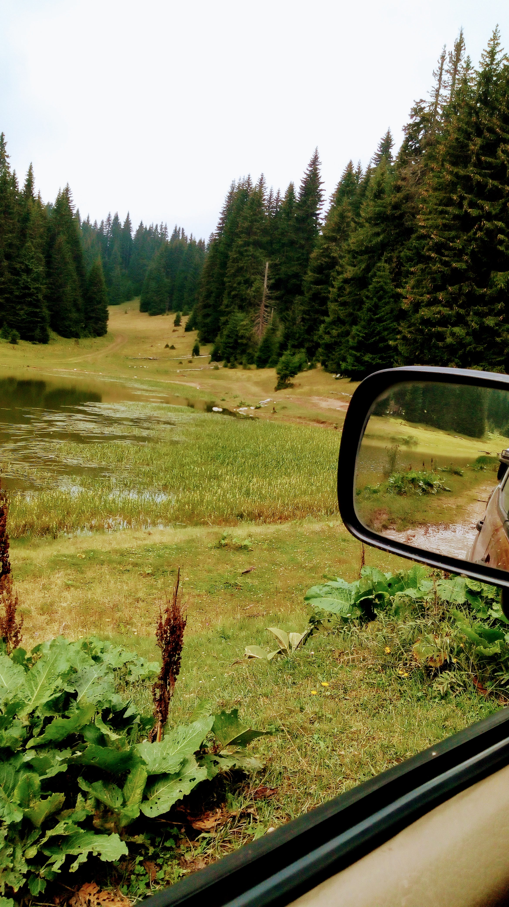
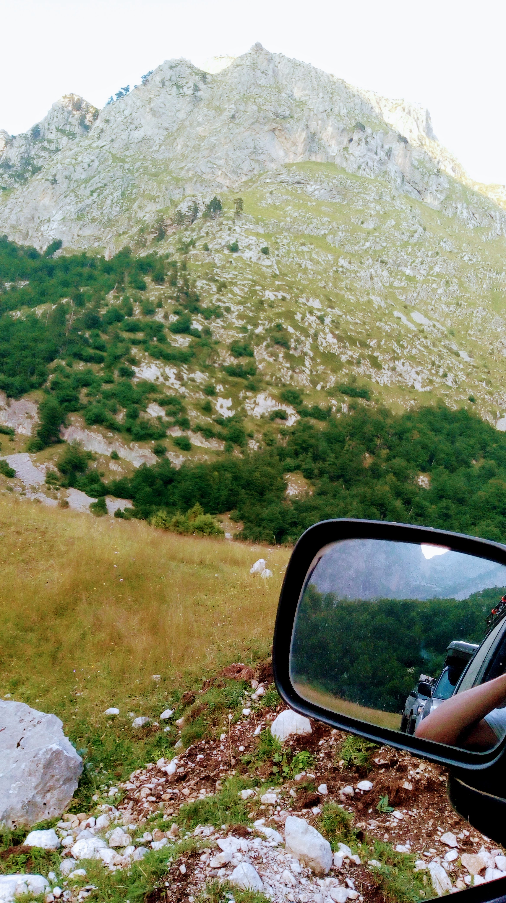
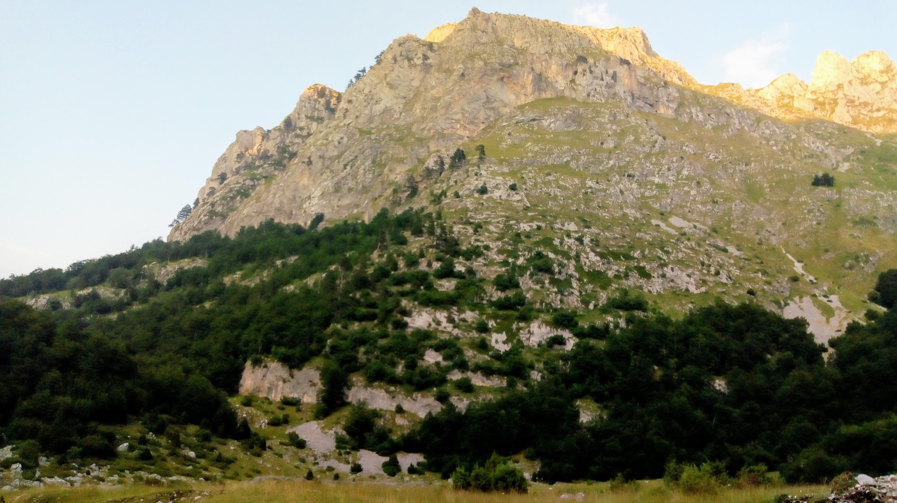
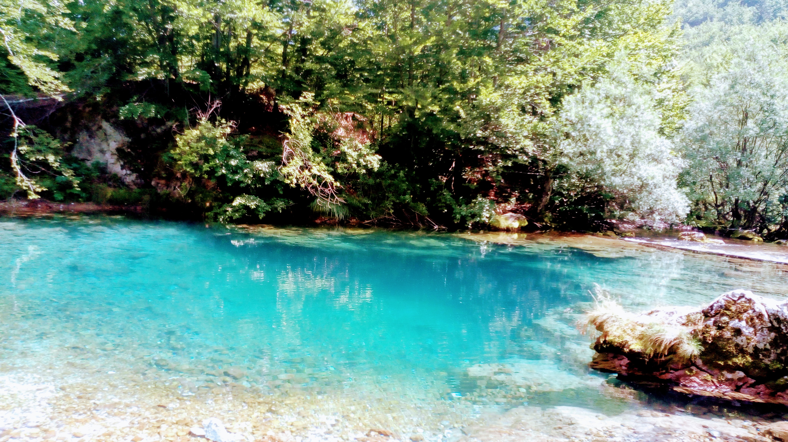
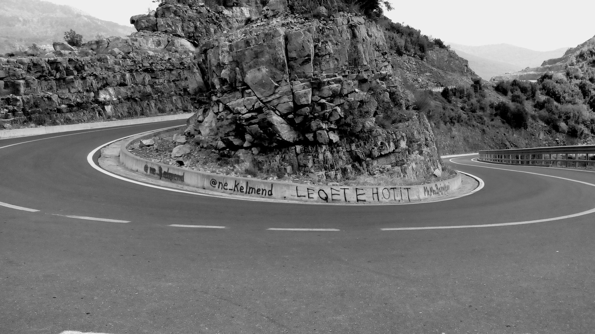

---

### Serbia

land of Zastava, Yugo i Golf II.
Below there is one of these ;)

<Row>
<Col>

</Col>
<Col>

</Col>
</Row>
<Row>
<Col>

</Col>
<Col>

</Col>
</Row>

### Montenegro

Here some upgrade took place. For climbing into mountain areas, "locals" used to take advantage by very durable, german Golf III ;)

<Row>
<Col>

</Col>
<Col>

</Col>
</Row>

<Row>
<Col>

</Col>
</Row>
<Row>
<Col>

Alipasha river source

</Col>
</Row>

### Albania - gorgeous SH-20 trail

<Row>
<Col>

</Col>
</Row>

---

